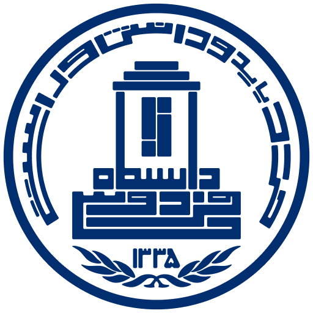
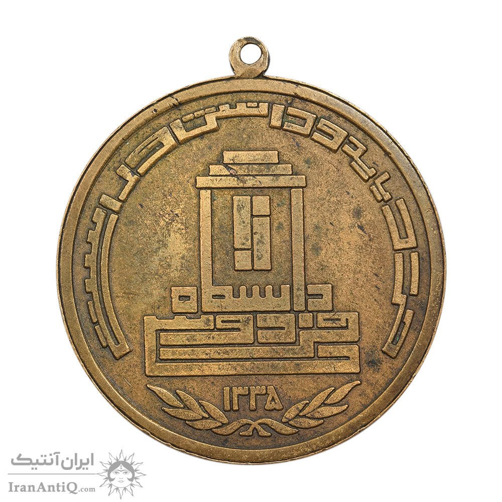
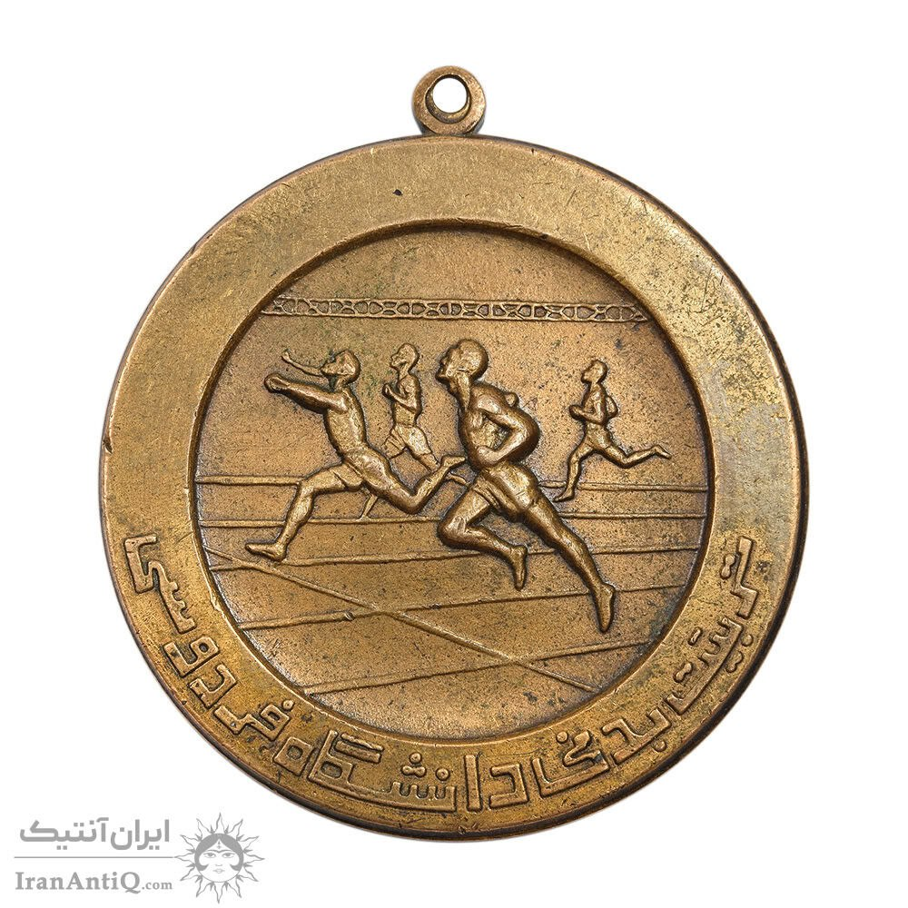
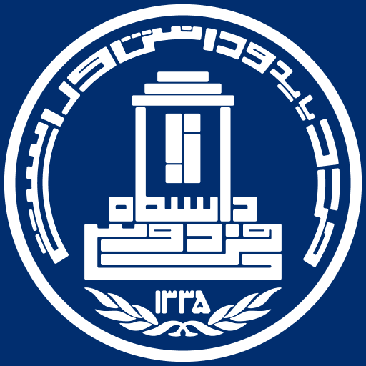

# Ferdowsi Lost Logo

  

  <em>The original seal of Ferdowsi University of Mashhad — 
  lost for decades, restored from an antique medal.</em>

---

## The Story

I almost studied chemical engineering.

Before finding my way to Industrial Design at the University of Tehran, I spent 
a semester at Ferdowsi University of Mashhad, enrolled in BSc Chemical 
Engineering. It was the wrong place, the wrong subject — I knew it quickly, and 
left. But I never stopped loving that university. It was the university of my 
city. Every summer, when I came back to Mashhad from Tehran, I found myself 
walking its grounds again.

One of those visits was less romantic. I was there to sign the paperwork for my 
withdrawal — forms, stamps, the bureaucratic ritual of officially becoming 
someone who had changed their mind. While waiting in the main office of academic 
affairs, I noticed a board on the wall: diplomas of notable alumni, arranged 
chronologically, oldest at the top.

On the older ones, the university seal was different.

It stopped me. The name of the university was lettered in the shape of Ferdowsi's 
tomb. Around it, an arc carried the university motto in elegant Persian: 
*خرد باید و دانش و راستی* — *Wisdom, knowledge, and integrity.* The proportions 
were considered. The geometry was deliberate. It felt like something designed by 
someone who understood what a university is supposed to mean.

Then I looked at what had replaced it. A pen. A book. The minaret and dome of 
the Holy Shrine of Imam Reza. Beautiful symbols — of the city. Not of the 
university. Nothing that speaks to knowledge, or to Ferdowsi, or to the idea 
that a place of learning should have its own identity, separate from the skyline 
outside its gates.

I understood immediately what had happened. And I felt the particular sadness 
of recognizing an erasure.

After the revolution, the original logo had been quietly retired. No archive. 
No history. No trace online — as though it had never existed. As though there 
was nothing here before.

---

## The Medal

That image stayed with me for years. I couldn't find it anywhere — not in 
university publications, not in any digital archive, not in any corner of the 
internet that I could reach. It was as if the logo had been not just replaced, 
but unmade.

Then, by chance, I found it on an antique shop listing: a pre-revolution sports 
medal from Ferdowsi University's Faculty of Physical Education and Sport Sciences. 
One face showed runners mid-competition. The other face showed the seal — 
complete, clear, exactly as I remembered it from that board on the wall.

I saved the images without hesitation.

  
  &nbsp;&nbsp;&nbsp;
  

  <em>The antique medal — front face (left) and reverse bearing the original seal (right).</em>

- 🔗 [Original medal listing on iranantiq.com](https://iranantiq.com/033416-physical-education-of-ferdowsi-university-sport-medal-ef-mohammad-reza-shah)

---

## The Restoration

A month later, just before Nowruz 2585, I started rebuilding it.

Using Rhinoceros, I laid guidelines over the medal photograph and redrew the 
logo from scratch — not tracing, but reconstructing. I wanted to understand the 
original designer's logic, not just copy their shapes. I looked for the base 
unit, the symmetry axes, the spatial rhythm, the vanishing point. I tried to 
find the geometry underneath the geometry — the decisions that an unknown 
designer had made, probably decades ago, that gave this mark its quiet authority.

I don't know who they were. I wish I did.

---

## Archival Note

Ferdowsi University of Mashhad (FUM), established in 1949, is one of Iran's 
oldest and most prominent public research universities. It bears the name of 
Abolqasem Ferdowsi (940–1020 CE), the Persian poet whose Shahnameh — composed 
over three decades — is credited with preserving the Persian language and 
cultural identity during a period of significant historical pressure.

The university's original institutional seal reflected this legacy directly. 
The name of the university was typeset in the architectural form of Ferdowsi's 
tomb in Tus. An arc surrounding the emblem carried the university motto: 
*خرد باید و دانش و راستی* — *Wisdom, knowledge, and integrity.* The design was 
geometrically disciplined, with considered proportions and a clear visual logic 
grounded in the institution's academic identity.

Following the 1979 Islamic Revolution, the seal was replaced. The current logo 
features a pen, a book, and the minaret and dome of the Shrine of Imam Reza — 
symbols associated with the city of Mashhad rather than with the university's 
academic mission or its namesake. No official record of the transition has been 
made publicly available. The original seal does not appear in any digital 
archive, university publication, or institutional history accessible online.

The sole known surviving image of the original seal was identified on the 
antique medal described above. This appears to be the only publicly accessible 
photographic record of the original seal in existence. No institutional archive, 
published history, or digital repository has been identified that documents the 
original design or the circumstances of its replacement.

### Methodology

The vector reconstruction was produced in Rhinoceros 3D using the medal 
photograph as a reference. The process was not mechanical tracing but geometric 
reconstruction: guidelines were established from the photograph to identify 
symmetry axes, proportional relationships, spatial intervals, and the base unit 
underlying the composition. Each element was redrawn in accordance with the 
inferred design logic of the original, with the aim of preserving the intent 
and internal consistency of the source material rather than reproducing its 
surface appearance alone.

The identity of the original designer is not known. Any information that would 
allow proper attribution would be welcomed — please open an issue or get in touch.

---

## Preview

  
  &nbsp;&nbsp;&nbsp;
  

  <em>Blue on white (left) — White on blue (right).</em>

---

## Files

| File | Format | Description |
|---|---|---|
| `ferdowsi-university-original-logo-white.svg` | SVG | Blue logo on white background |
| `ferdowsi-university-original-logo-blue.svg` | SVG | White logo on blue background |

---

## License

This work is released under **CC0 1.0 Universal** — no rights reserved.  
Use it, share it, print it, build with it. No attribution required.

The goal is simple: this logo should be free for anyone to use,
and everyone should know it exists.

---

## A Call

If you know who designed the original logo — the person who built that geometry, 
chose those proportions, wrote that motto around that arc — please open an issue 
or get in touch. They deserve to be known.

And if you are involved with Ferdowsi University of Mashhad: this logo exists. 
It is better than what replaced it. It deserves to come back.

---

## Why Today

Today, May 15, is the National Day of Ferdowsi and Persian Language Day in Iran.

Ferdowsi spent thirty years writing the Shahnameh — not for fame, not for money, 
but to preserve the Persian language and Iranian identity at a time when both 
were under threat. We Iranians owe our language, our culture, our sense of who 
we are, in no small part to him.

A university that bears his name deserves a logo worthy of that name.

This is a very small tribute.

---

*Restored by [Shakib Alipour](https://shakib.design) — Milan, May 15, 2026*  
*[linkedin.com/in/shakib-alipour](https://linkedin.com/in/shakib-alipour)*
